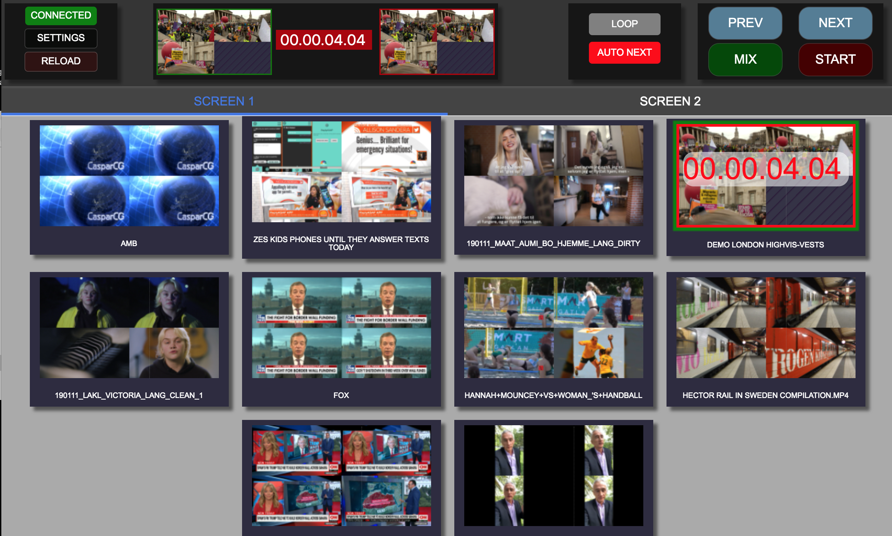
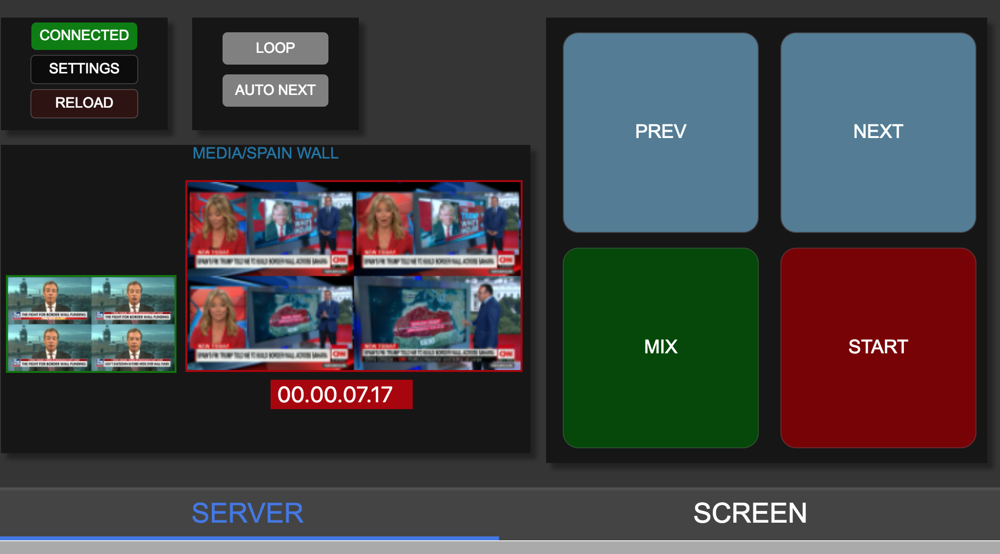

## Caspar CG Clip Tool
CasparCG ClipTool is a clip tool that scans predefined folders, and let´s you play it out on predefined outputs.

### Normal View:
(VIEW button toggles between views)



### Text View for small touchscreen: 


### Control View for small touchscreen: 



## Features:
* Each output is in it´s own separate Tab, so it´s easy to change a loop on one screen without messing with the others. If an output is not in use, remove the name of the output in settings. And if you on one client only need e.g. Output 2 - then remove the name of output 1, 3 and 4.

* Each thumb has PVW que on the left half of the thumb, and PGM-que on the right part of the thumb. A discrete dotted line shows where the PVW/PGM split is.

* If "LOOP" is on it will loop the selected clip.

* Using "MIX" will mix from the active clip (red tally) to the preview clip (green tally)

* You can use "AUTONEXT" if you wan´t ro run the clips as a playlist, and you just drag´n´drop to change the order of the list.

* Shortcuts for start and mix. Makes it easy to add GPIO triggering.
  * 1,2,3,4 mixes pvw into pgm
  * q,w,e,r start clip on output 1,2,3,4

* Disable Drag´n´drop in settings. For touchscreens and when someone else or an external source sets the order of the playlist.

* It´s possible to add overlay graphics by adding metaData files in the CasparCG data folder.
The name of the metadata has to be:
```
 {name_of_the_mediafile}.meta.ftd
```

* A basic example of how to use overlay can be found in the:
Example-using-overlay folder inside this repo.
Theres also the HTML template it calls.

* A converter for iNews ftp -> metaData files can be found here:
https://github.com/olzzon/tv2-inews-metadata-converter


## Install and run:

### Prebuild versions:
CasparCG-ClipTool is prebuild for Mac and Windows.
````
https://github.com/olzzon/CasparCG-ClipTool/releases
````
I order to use the ClipTool you need to run CasparCG-State-Scanner on the server CasparCG Server (https://github.com/olzzon/casparcg-state-scanner/releases/)


### Build:
```
git clone https://github.com/olzzon/CasparCG-ClipTool.git nameofyourproject
cd nameofyourproject
yarn
/* the next steps are neede to build develop version of casparcg-connection
cd node_modules/casparcg-connection
yarn
yarn build
cd ..
cd ..

```

### Run the app
```
yarn start
```

### Build the app (automatic)
```
yarn package
```

### Build the app (manual)
```
yarn build
```

### Test the app (`yarn run build`)
```
yarn prod
```


### Based on:
Using SuperflyTV CasparCG-Connection ACMP protocol:
```
https://github.com/SuperFlyTV/casparcg-connection
```

### React-Electron boilerplate from:
Minimal Electron, React and Webpack boilerplate

```
 https://github.com/alexdevero/electron-react-webpack-boilerplate.git
```


### Code of Conduct for electron-react-webpack-boilerplate:

[Contributor Code of Conduct](code-of-conduct.md). By participating in this project you agree to abide by its terms.

### License for electron-react-webpack-boilerplate:

MIT © [Alex Devero](https://alexdevero.com).
