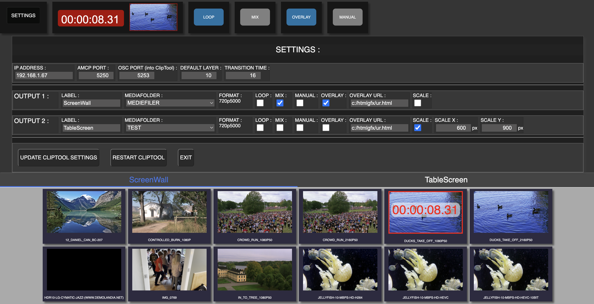

## Caspar CG Clip Tool

CasparCG ClipTool is a playout tool with a thumbnail based GUI.

### Normal View:


### Text View for small touchscreen:


## Features:

-   Each output is in it´s own separate Tab, so it´s easy to change a loop on one screen without messing with the others. Only the number of the connected CasparCG server are available.

-   Click on a thumbnail to play the file

-   "LOOP" is ON: Clip will loop whan started

-   "MIX" is ON: CasparCG will mix from currentclip to the next one (e.g. Mix from one loop on a screen to another)

-   "MANUAL" is ON: When clicking on a thumb it will be loaded on CasparCG, pressing "START" to play the clip

-   "OVERLAY" is ON: The source of overlayURL from settings will be played on top of the clip

### Settings:



### On each output you can set:

-   Label
-   Folder (CasparCG Media subfolders)
-   Startup state for loop, mix, manual and overlay
-   URL for the Overlay (e.g. a static html or a web page)
-   Scaling

## Install and run:

### Prebuild versions:

CasparCG-ClipTool is prebuild for Windows. The Pre-build are located in the /package folder on the repository

Download and place "casparcg-clip-tool.exe" in your CasparCG folder.

Run the file and open GUI in browser: http://localhost:5555
If you want to run in textview for small touchscreens use :http://localhost:5555/?textview=1

### Using CasparCG Launcher:

ClipTool works great with CasparCG Launcher, just add "casparcg-clip-tool.exe" as a process under settings.

You can grab CasparCG Launcher here:

```
https://github.com/nrkno/tv-automation-casparcg-launcher/releases
```

## Important -- Add OSC support to casparcg.config:

### otherwise timer and preview window won´t work

_Be aware that the last part of the default casparcg.config file is an commented part, so you should move the OSC part into the "configuration" part of the file_

```
<osc>
  <default-port>6250</default-port>
  <disable-send-to-amcp-clients>false [true|false]</disable-send-to-amcp-clients>
  <predefined-clients>
    <predefined-client>
      <address>127.0.0.1</address>
      <port>5253</port>
    </predefined-client>
  </predefined-clients>
</osc>
```

## ClipTool Gateway:

_OSC and AMP remote control protocols_

The "cliptool-gateway.exe" file is used for remote controlling ClipTool from e.g. a video mixer.

Place it in the CasparCG server folder.

### To run with AMP protocol use:

cliptool-gateway.exe -type='amp'
(this will create an AMP gateway at port 3811)

### To run with OSC protocol use:

cliptool-gateway.exe -type='osc'
(this will create an OSC gateway at port 5256)

The OSC protocol has the following commands:
/channel/{output}/play
/channel/{output}/load

## Build for development (nodejs):

```
git clone https://github.com/olzzon/CasparCG-ClipTool.git nameofyourproject
cd nameofyourproject
yarn
yarn build-server
yarn build-client
yarn start
```

### Run the app

```
yarn start
```

Open GUI in browser: http://localhost:5555
If you want to run in textview for small touchscreens use :http://localhost:5555/?textview=1

Only view one Output channel: http://localhost:5555/?channel=2

### Build the app

```
yarn package
```

### Based on:

Using SuperflyTV CasparCG-Connection ACMP protocol:

```
https://github.com/SuperFlyTV/casparcg-connection
```
