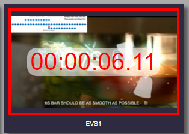
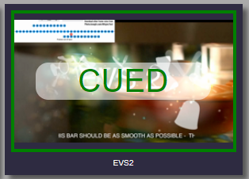
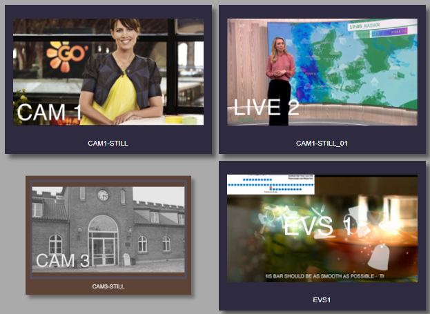
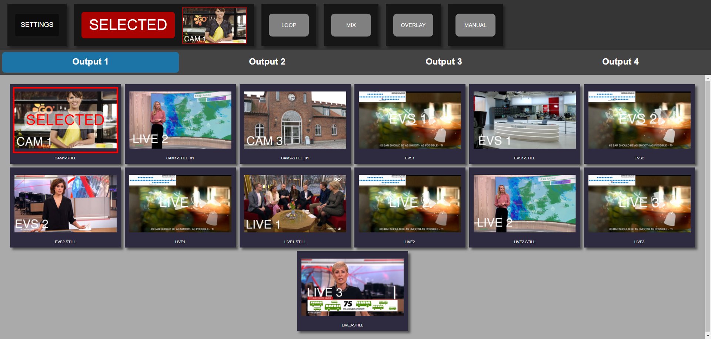
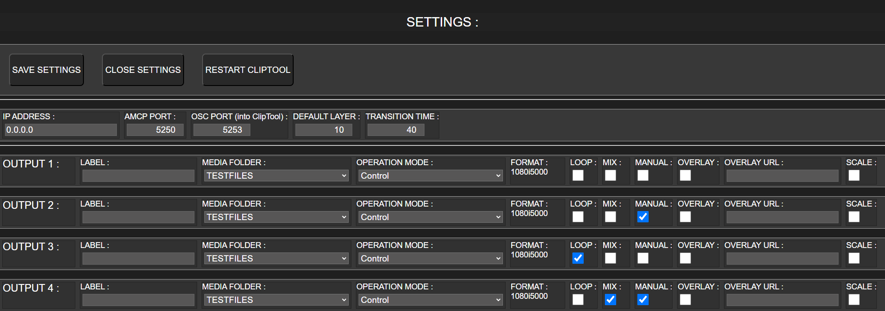
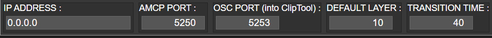
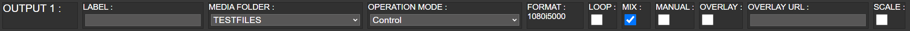
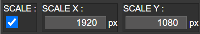

# CasparCG Cliptool

CasparCG ClipTool is a playout tool with a thumbnail based GUI.

## Table of Content

-   [Table of Content](#table-of-content)
-   [Features](#features)
    -   [Header](#header)
    -   [Tabs](#tabs)
    -   [Playout](#playout)
    -   [Hiding](#hiding)
    -   [Recovery](#recovery)
    -   [Touch Support](#touch-support)
-   [View Modes](#view-modes)
    -   [Main View](#main-view)
    -   [Text View](#text-view)
    -   [Channel View](#channel-view)
-   [Settings](#settings)
    -   [Buttons](#buttons)
    -   [CasparCG Settings](#casparcg-settings)
    -   [Channel / Output Options](#channel--output-options)
-   [Installing Cliptool](#installing-cliptool)
    -   [Important](#important)
    -   [CasparCG Launcher](#casparcg-launcher)
-   [Running Cliptool](#running-cliptool)
-   [Installing Cliptool Gateway](#installing-cliptool-gateway)
-   [Running Cliptool Gateway](#running-cliptool-gateway)
    -   [AMP Protocol](#amp-protocol)
    -   [OSC Protocol](#osc-protocol)
-   [Development](#development)
    -   [Building](#building)
    -   [Running](#running)
    -   [Packaging](#packaging)
-   [Noteworthy Packages](#noteworthy-packages)

## Features

Cliptool features many common webpage features, but also a handful of less common ones.
Subsections below will descibe these feature, with other sections in this Readme supplementing them.

### Header

In the header there is a button that can be used to open the [Settings Page](#settings).
This button is not visible on the [text view](#view-modes).

The header contains a countdown of currently playing video file, or indicator that a image file is loaded.
In either instance, the thumbnail of the playing file will also be shown.

The header also contains 4 togglebuttons, Loop, Mix, Overlay and Manual.
The first 3 of them are not visible from the [text view](#view-modes), but still in effect, if enable from another [view mode](#view-modes).
More details about what these button do are described during their individual section under the [settings Page](#settings).

Should the space for the header become limited, due to e.g a narrow window size, then the header will be horizontally scrollable.

### Tabs

Each channel defined in CasparCG's configuration file coresponse to its own tab in Cliptool.

Tabs are only visible while the view does not have a specified channel in the query, as specified in the [view mode](#view-modes) section further down.

Buttons located in the [header](#header) will directly impact settings related to the currently active tab.

The [label](#label) show on each tab can be set from the [settings page](#settings).

Should the space for the tabs become limited, due to e.g long tab names, then the tabs will become horizontally scrollable, just like the header.

### Playout

Playing videos or images from Cliptool is as simple as placing them in the media folder that CasparCG is looking,
and then clicking the associated file in Cliptool, on the tab of the channel one wish the file to be played on.
Depending on the different toggle switches in the header, slightly different outcomes might happen.

When a image file is played it will get a red border and the text 'SELECTED'.
This will also be shown in the header.


When a video file is played it will get a red border and text showing the remaining duration.
This will also be shown in the header.



When a video file is clicked while [manual](#manual) mode has been enabled from the header or settings page,
it will instead of playing the file only load it, allowing the user to manualy start it.
The currently loaded video file will be shown with a green border and the text 'CUED'.

As there are no difference between loading and playing an image file,
clicking an image file while [manual](#manual) mode has been enabled, will simply play it instead.



### Hiding

It is possible to hide files from being shown in Cliptool.
This is ideal if multiple small variation of the same file is generated and placed in CasparCG's media folder, but only one is desired to be used.

To hide files, first the operation mode of a channel, on which you wish to hide files, must be changed.
The operation mode of a channel can be selected from a dropdown on the settings page.
This is described in more detail during the [operation mode](#operation-mode) section under Settings.

Ones in the 'Edit Visibility' operation mode, then clicking on files will toggle their visibility, hiding them ones out of the 'Edit Visibility' operation mode.
Files that are currently being played or loaded on one or more tabs can not be hidden, and attempting to do so will show a popup stating so.
Files that are currently marked to be hidden will be shrunken, greyed out with a brown background.
Image showing a hidden file amoung non-hidden ones can be seen below.



To return to the normal operation mode, either change the dropdown for the channel in settings back to 'Control',
or hit the 'Exit Edit Visibility' button in the page footer shown while in the 'Edit Visibility' operation mode.

### Recovery

Should Cliptool loss connection to CasparCG at some point, and then regain connection, it will resend the play commands.
If a channel is already playing something, Cliptool will skip that channel, as to not disturb what is playing.

On startup of Cliptool, Cliptool will update its indicated playing and loaded files, according to what CasparCG is currently playing / have loaded.
Because of this, should Cliptool crash or otherwise restart, and a change to what is playing on CasparCG be done in the meantime, then Cliptool will update accordingly on startup.
This means that the selected or loaded file indicator will update in Cliptool, if CasparCG is send a command from outside, during Cliptools downtime.

### Touch Support

Cliptool has support for Touch, allowing the user to change the active tab by swiping left and right in the main area, where files are being displayed.
If space is limited such that the [header](#header) or [tabs](#tabs) have become scrollable, these will also be scrollable via touch.

Take care not to swipe to far, as the browsers in-built swipe actions are not disabled by Cliptool.
For instance on Google Chrome, swiping left or right will act as going backward (left) or forward (right) in the tabs history.
Other browser likely have similar actions on swipe.

## View Modes

Cliptool has a couple of view modes, accessed by adding different query parameters when accessing Cliptool.

-   No Extra parameters to the query, makes you enter the **main view** mode.
-   Adding `/?textview=1` to the query will enable the **text view** mode, where thumbnails for the files are not rendered.
-   Adding `/?channel=1` to the query will enable the **channel view** mode, where the chosen tab is locked to the channel defined in the query.
    -   The channel number is 1-indexed. Given a 0, will give the first channel.
-   Adding `/?textview=1` and `/?channel=1` will enable the **channel text view** mode, which is a mix of both of the previously described modes.

Take note on the names used for the view modes, e.g 'main view', as they are likely to be used during this ReadMe.
Below are example images of the main, text and channel view modes.

### Main View



### Text View


### Channel View


## Settings

Clicking the 'Settings' button in the header will open the Settings page.
An image showing the Settings page can be seen below, as seen from the [main view](#view-modes).



Settings are split into 3 parts.

-   Buttons
-   CasparCG settings
    -   These are not shown if settings is entered from the [channel view](#view-modes).
-   Channel settings, which are named outputs in Cliptool.
    -   Only the one defined in the query is seen, if settings is entered from the [channel view](#view-modes).

### Buttons

#### Save Settings

If no changes have been made, then this button does nothing.

If changes has been made, then this button prompts the user, if they wish to save their changes.
If cancelled, the prompt simply closes.
If accepted, then the changes are saved, and the settings page is closed.

#### Close Settings

When no changes has been made this button will be displayed with the text 'Close Settings',
and on clicking it will simply do as the button states.

If changes have been made, the text displayed will update to display 'Discard Changes & Close Settings'.
Upon clicking it while changes have been made, the user will be prompted if they truly wish to discard changes.
If cancelled, the prompt simply closes.
If accepted, then the changes are discarded, and the settings page is closed.

#### Restart Cliptool

This button is not shown when settings are accessed from the [channel view](#view-modes).

When clicked it simply makes Cliptool stop.
Cliptool, along with CasparCG and Media Scanner, tends to be run through **CasparCG Launcher**.
When a process handled by **CasparCG Launcher** exits, then **CasparCG Launcher** will restart it.
This is what Cliptool leverages, for its restart functionality.
As such it should be noted that this button will not Restart Cliptool, if not running from **CasparCG Launcher**.

How to get **CasparCG Launcher** is described further down, in the [CasparCG Launcher](#casparcg-launcher) section.

### CasparCG Settings

In Cliptool there are a few settings related to CasparCG, which can be updated from the settings page.
These mainly revolves around where to send/receive requests to/from CasparCG, and some playout options.



#### Ip Address

This fields defines where Cliptool will attempt to communicate with CasparCG.
If the [installation guide](#installing-cliptool) further down has been followed,
then this should remain as shown on the image above.

#### Amcp Port

The port on which Cliptool will send Amcp request to CasparCG.
This should match the port number defined in the CasparCG configuration file, under the `controllers` section.

#### Osc Port

The port on which Cliptool will receive Osc message from CasparCG.
This should match the port number defined in the CasparCG configuration file, under the `osc` section.

#### Default Layer

The layer which playout will place played or loaded files on.

#### Transition Time

The time in frames that a change from file A to file B takes, while using [Mix](#mix).
25 frames equals 1 second.

### Channel / Output Options

Each output has a number of option that can be updated from the settings page.



#### Label

Setting a text in the label field, will update the text shown on the associated tab, while on the main or text view.
If nothing is specified, then the tab will simply display `Output`, followed by the number of the output.

#### Media Folder

Selecting a folder from the dropdown, will narrow in the files shown in the associated tab.
The options available include a blank one, which will show all files in CasparCG's media folder,
and an option for each sub-folder in CasparCG's media folder, including sub-folders of those folders ad infinitum.

#### Operation Mode

Changing the selected option in this dropdown will change what happens when a file is clicked, on the associated tab.
There are two Operation modes, _Control_ and _Edit Visibility_, with _Control_ being the default mode.

While in _Control_ mode you will be able to send play and load commands to CasparCG by clicking on files.
In this mode files marked to be hidden, will not be shown.

While in _Edit Visibility_ mode you will be able to toggle the visibility of files by clicking on them.
In this mode files marked to be hidden, will be shown.
The [hiding](#hiding) section earlier describes hiding of files in more detail.

#### Loop

Defines if playing video files on the associated tab should loop indefinetly.
Enabling it will not cause already playing video files to loop, and vice versa.

#### Mix

Defines if playing files on the associated tab should use a mix effect when changing from one file to another.
How long time the transition takes is defined by [Transition Time](#transition-time) under CasparCG settings.

#### Manual

Defines if video files should only be loaded, and then be manually started on the associated tab.
While enabled a new button will be visible in the header, which allows the user to start a loaded video file.

#### Overlay

Defines if the Url in [Overlay Orl](#overlay-url) should be loaded and shown over files played on the associated tab.

#### Overlay Url

Defines the Url that should be shown while the [Overlay](#overlay) is active on the associated tab.

#### Scaling

Defines if a played file on the associated tab should be scaled to some fixed dimensions.
While enabled two new fields will be shown, allowing the user to set a desired X and Y size in pixels.



## Installing Cliptool

Cliptool is prebuilt for Windows. Simply download the desired version from the [release page](https://github.com/tv2/casparcg-cliptool/releases).
Ones you have downloaded the desired version of `casparcg-clip-tool.exe`, drop it into the folder for CasparCG.

### Important

For Cliptools timer and preview of selected file in the header to work,
CasparCG's `casparcg.config` file needs to have an `osc` section.

CasparCG's default config file contains a out-commented version of the `osc` section.
That section should be moved to be part of the configuration, and of course un-commented.

In case the config file has removed the `osc` section for some reason, then it can also be found below.

The port defined under the `predefined-client` part of the `osc` section should match the port inputed to the [CasparCG Settings](#casparcg-settings)

```
<osc>
  <default-port>6250</default-port>
  <disable-send-to-amcp-clients>false [true|false]</disable-send-to-amcp-clients>
  <predefined-clients>
    <predefined-client>
      <address>127.0.0.1</address>
      <port>5253</port>
    </predefined-client>
  </predefined-clients>
</osc>
```

### CasparCG Launcher

Cliptool works great with CasparCG Launcher, and it is also highly recommended that Cliptool is run by use of CasparCG Launcher, for the restart capability.
CasparCG Launcher can be downloaded from its [release page](https://github.com/nrkno/tv-automation-casparcg-launcher/releases).

Once CasparCG Launcher is downloaded and placed inside the CasparCG folder, simply add `casparcg-clip-tool.exe` as a process under settings.
With the CasparCG Launcher placed inside the CasparCG folder, the `Base Path` should simply be set to '`./`'

## Running Cliptool

To run Cliptool either start Cliptool, CasparCG and Media Scanner executables yourself or start CasparCG Launcher, and start the 3 programs from there.
The order of starting the programs doesn't matter.

After Cliptool has started, then the GUI can be accessed from a browser at [localhost:5555](http://localhost:5555).
From that address the query parameters specified in [View Modes](#view-modes) can be suffixed to alter what or how things are shown.

For easy access and example, the suffixed view modes links are listed below.

-   [Text View](http://localhost:5555/?textview=1)
-   [Channel View](http://localhost:5555/?channel=1)
-   [Text Channel View](http://localhost:5555/?channel=1&textview=1)

## Installing Cliptool Gateway

Cliptool Gateway is prebuilt for Windows. Simply download the desired version from the [release page](https://github.com/tv2/casparcg-cliptool/releases).
Ones you have downloaded the desired version of `cliptool-gateway.exe`, drop it into the folder for CasparCG.

## Running Cliptool Gateway

Cliptool Gateway allows Cliptool to be controlled from outside by use of OSC and/or AMP remote control protocols.
The `cliptool-gateway.exe` file is used for remote controlling ClipTool from e.g. a video mixer.

For the Cliptool Gateway to work, Cliptool itself also needs to run.
Another requirement of the Cliptool Gateway is that it needs an arguement upon start to determin if it should use OSC or AMP.

The argument can be supplied in any way you want. Examples include but are not limited to.

-   Giving it as an argument to a shortcut
-   Giving it as an argument when executing from commandline.
-   Giving is as an argument when configuraing with CasparCG Launcher.

### AMP Protocol

To start Cliptool Gateway as an AMP gateway, then the argument `-type=amp` has to be given to the execuable at launch.
There is a couble of ways to supply the arguement.
Regardless of how it is supplied, the Cliptool Gateway will create an AMP gateway on port 3811.

-   Shortcut

```
Target: "<your-casparcg-server-installation-folder>\cliptool-gateway.exe" -type=amp
```

-   Commandline

```
cd <your-casparcg-server-installation-folder>
cliptool-gateway.exe -type=amp
```

-   CasparCG Launcher Argument

```
Executable: cliptool-gateway.exe
Arguments: -type=amp
```

### OSC Protocol

To start Cliptool Gateway as an OSC gateway, then the argument `-type=osc` has to be given to the execuable at launch.
There is a couble of ways to supply the arguement.
Regardless of how it is supplied, the Cliptool Gateway will create an OSC gateway on port 5256.

-   Shortcut

```
Target: "<your-casparcg-server-installation-folder>\cliptool-gateway.exe" -type=osc
```

-   Commandline

```
cd <your-casparcg-server-installation-folder>
cliptool-gateway.exe -type=osc
```

-   CasparCG Launcher Argument

```
Executable: cliptool-gateway.exe
Arguments: -type=osc
```

The OSC protocol has the following commands.

```
/channel/{output}/play
/channel/{output}/load
```

## Development

To get started with development, clone this repository to a local location of your choosing.

```
git clone https://github.com/tv2/casparcg-cliptool.git nameofyourproject
```

After doing that, follow the following subsections.

### Building

To build Cliptool run the following commands.

```
yarn
yarn build
```

Failure to run `yarn build` atleast ones, and instead rely on [watching for changes](#watching-for-changes),
will result in the following error, when trying to open Cliptool in the browser.

```
TypeError: path must be absolute or specify root to res.sendFile
    at ServerResponse.sendFile (C:\Code\Tv2\Sofie-Related\casparcg-cliptool\node_modules\express\lib\response.js:441:11)
    at C:\Code\Tv2\Sofie-Related\casparcg-cliptool\build\server\services\express-service.js:49:21
    at Layer.handle [as handle_request] (C:\Code\Tv2\Sofie-Related\casparcg-cliptool\node_modules\express\lib\router\layer.js:95:5)
    at next (C:\Code\Tv2\Sofie-Related\casparcg-cliptool\node_modules\express\lib\router\route.js:144:13)
    at Route.dispatch (C:\Code\Tv2\Sofie-Related\casparcg-cliptool\node_modules\express\lib\router\route.js:114:3)
    at Layer.handle [as handle_request] (C:\Code\Tv2\Sofie-Related\casparcg-cliptool\node_modules\express\lib\router\layer.js:95:5)
    at C:\Code\Tv2\Sofie-Related\casparcg-cliptool\node_modules\express\lib\router\index.js:284:15
    at Function.process_params (C:\Code\Tv2\Sofie-Related\casparcg-cliptool\node_modules\express\lib\router\index.js:346:12)
    at next (C:\Code\Tv2\Sofie-Related\casparcg-cliptool\node_modules\express\lib\router\index.js:280:10)
    at SendStream.error (C:\Code\Tv2\Sofie-Related\casparcg-cliptool\node_modules\serve-static\index.js:121:7)
```

#### Watching for Changes

To watch for changes to client, server and gateway, run the following command.

```
yarn watch-changes
```

If one wish to split the watch into multiple terminals the underlying '`yarn watch-client`', '`yarn watch-server`' and '`yarn watch-gateway`' can be used.

### Running

To run Cliptool for development purposes, it is recommended to [watch for changes](#watching-for-changes), therefore a minimum of two terminals are needed.
One terminal will be watching for changes and one will run Cliptool.
For running Cliptool, there are 3 commands to chose from, depending on the desired log level.

For production level logs use the following command.

```
yarn start
```

For development level logs use the following command.

```
yarn start-dev
```

For trace level logs use the following command.

```
yarn start-local
```

Ones running, navigate to the address as if run from an executable, specified during [Running Cliptool](#running-cliptool)

### Packaging

To create a packaged executable of Cliptool and Cliptool Gateway, ready for release, run the following commands from the root of the cloned repository.

```
yarn build
yarn package
```

## Noteworthy Packages

Cliptool makes use of SuperflyTV's CasparCG-Connection ACMP protocol:

```
https://github.com/SuperFlyTV/casparcg-connection
```
